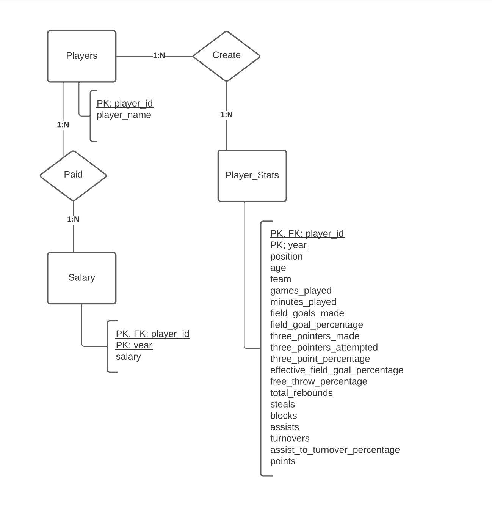
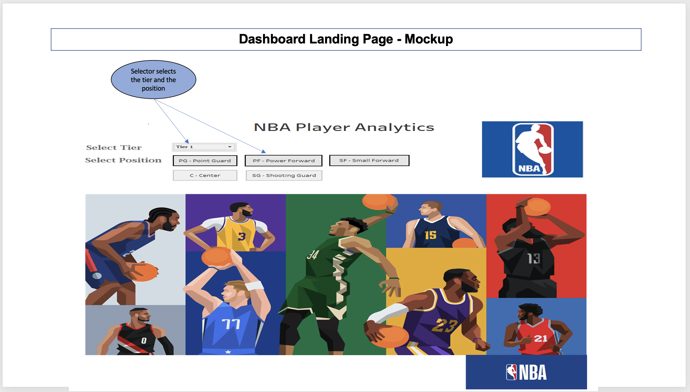
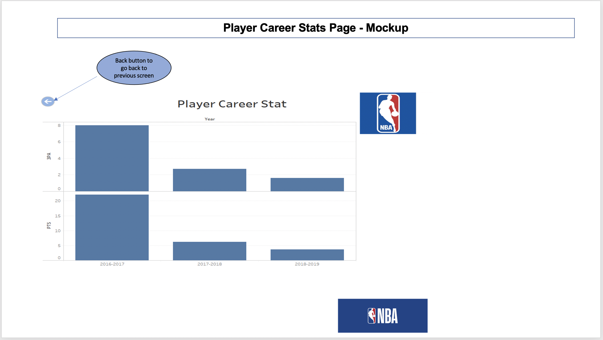
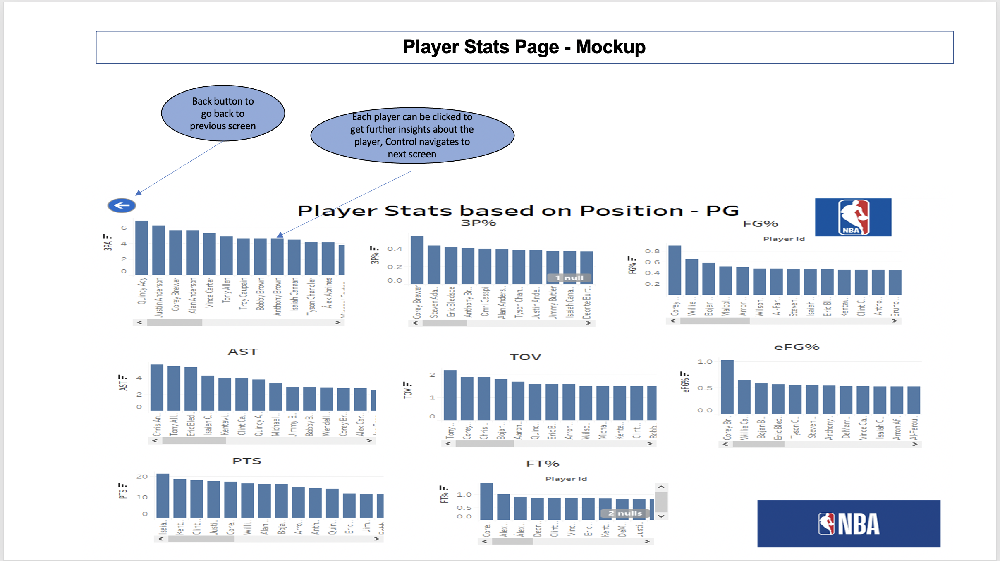

# nba-player-analytics

## Project Overview
There is a new club that wants to build a team and they want to sign up contract with different players.
1. They have a budget of 110 million USD. They want to build a well-balanced team choosing players of different tiers. They want to see players of different tiers so that they can sign up with them
A Colorado Board of Elections employee has given you the following tasks to complete the election audit of a recent local congressional election. 
2. Also the club wanted to know whether a players salary is going to increase, decrease or remains similar in next subsequent seasons based on his performance statistics in NBA. This part of the project can help players who want to predict their salary. 

## Team
1. Asit M
2. Dave S
3. Dhana D
4. Rajesh R

## Resources 
- Data Source Files for NBA Player Stats
  - NBA Players Stats 201617.csv
  - NBA Players Stats 201718.csv
  - NBA Players Stats 201819.csv
  - NBA STATs19-20.csv
- Data Source Files for NBA Player Salaries
 - NBA Players Stats 201819.csv
 - NBA_salaries_2019_present.csv

## Branches
Branches for each teammate is 
- asit-modifications
- dave-modifications
- dhana-modifications
- rajesh-modifications

## Technology
- DataCleanup: Python 3.8.5, Jupyter Notebook, Visual Studio Code, 1.54.1
- Database: Postgres SQL
- Machine Learning: Python
- Dashboards: Tableau

## Project Summary
### Data Discovery
NBA Player Stats and Salary Info for 4 years from 2016-2019 were downloaded from Kaggle as 6 files. They were in 4 different formats. 
- Files had NBA player stats information for 4 years. They were in two different formats
- Files has NBA Salary information for many years and in two different formats
- Data files were cleaned and merged into two files 
 	- NBA Player Stats info for 4 years
	- NBA Salary info for 4 years
### Data Cleanup Tasks
- Split player column into two columns: player_id and player_name 
- Multiple rows exist for a player who is traded mid-season. 
    - Filter and keep the relevant row that has the total for the season
    - Add Salary from both teams and save it
- Convert Salary column to float after removing ‘$’ and space
- Add playing season as additional column
- Fill null values with 0 for stats and salary. 
- Pick the columns that is needed for analysis and rename them to match sql database design
The link that has Data Cleanup or ETL Steps performed were https://github.com/asitkumar26/nba-player-analytics/blob/main/Presentation/ETLSteps.xlsx

### Database ERD Diagram
- ERD Diagram: 

### Dashboard
The Dashboard that can be used for viewing and comparing a player stats and salary info will be as follows 
- Dashboard Landing Page Mockup: 
- Dashboard Player Career Stats Page Mockup: 
- Dashboard Players Stats Page for Comparison Mockup: 

### Machine Learning
**Un-supervised Learning for clustering players based on their player statistics:**
- Description of preliminary data processing:
	- Both player salary and player statistics data need to be referenced from database (Status – In- progress)
	- Consider players who have played all 4 seasons (2016-17, 2018-19,2019-20,2020-21) for machine learning (Status – In-progress)
	- Join player statistics and  player salary and average the stats and salary per player (Status - Complete)
	- Use all player statistics for clustering them through KMeans Model (Status - Complete)
	- Derive category  of players as player tiers based on the average salary per cluster (Status - Complete)
	
- The code git hub link is as follows:
  http://localhost:8888/notebooks/player-clustering.ipynb
  
 -  Description of Feature Engineering and Feature Selection:
 	-   Player statistics like ‘np_of_ghames-played’, ‘no_minutes_played’, ‘field_goals_pctg’, ‘three_point_pctg’, ’effective_field_goal_pctg’,  ‘free_throws_pctg’, ‘ total_rebounds’ ,’ no_of_assists’ ,’ no_of_steals’, ‘no_of_blocks’, ’ no_of_turnovers’, ‘points’ have been considered as features for clustering since these features reflect the player’s performance. This data is fed to Kmeans as features. 

- Why KMeans us used, its advantage and limitations:
	- KMeans is one of the most popular algoritm for un-supervised learning to find patterns and cluster them. 
	- Benefits  of Kmeans –  Simple to implement and  scales to large datasets
	- Limitations of Kmeans -  Choosing K Manually to find optimal K. It is always a trial and error method to find the   optimal K. 

**Supervised Learning to predict whether Player’s salary hike will happen or not:**
- Description of preliminary data processing:– 
	- Both player salary and player statistics data need to be referenced from database (Status – In- progress)
	- Consider players who have played all 4 seasons (2016-17, 2018-19,2019-20,2020-21) for machine learning (Status – In-progress)
	- Join player statistics and  player salary and average the stats and salary per player (Status - Complete)
	- Label the ‘Salary Increased or not’ by comparing the last year Vs First year salary of the players (Status – In-progress)
	- Train and Test the model through Random forest. 
	
- The code git hub link is as follows:  http://localhost:8888/notebooks/player-salaryraise-predictions.ipynb

- Description of Feature Engineering and Feature Selection:
	- A round of feature dependencies has been studied using ‘feature_importances_’. The features that had the least dependencies on predictions have been dropped from feature selections. 

	- Refer to the URL to see how the feature dependencies in order to predict the model. https://github.com/asitkumar26/nba-player-analytics/blob/main/ML-Models/Feature-Depnedencies-Supervised_learning.PNG

- Models used for Supervised Learning, its advantage and limitations:
	- Randomforest  is one of the most popular algoritm for supervised learning to do more accurate predictions.
 	- Benefits  of Random Forest –  Simple to implement and since it builds multiple decision trees and merges them together to get more accurate and stable decisions.
	- Limitations of Random Forest -  Need to be carefully observed because it has a chance of overfitting the model.

- Explanation of Model Choices:
	- Two models were tried out ‘Random Forest’ and ‘Logistic Regression’. But Random Forest provided better score. Hence chosen the ‘Random Forest’ for final model.   

- Description how they have been trained in the model:
	- Few of the techniques used to train to improve the model accuracy. They are:
		- Features like ‘Games Played’ and ‘Minutes Played’ have been scaled through MinMaxScalar.
                - Some of the features like ‘salary’ and ‘blocks’  have been dropped because their depnednecies on predictions 	were least.

- Description of Current Accuracy Score:    
	- Find the accuracy score and the Confusion Metrics from ‘Random Forest’ through following URL. https://github.com/asitkumar26/nba-player-analytics/blob/main/ML-Models/Model-Accuracy-Score-SupervisedLearning.PNG

  
